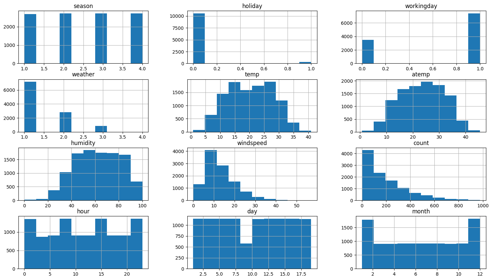
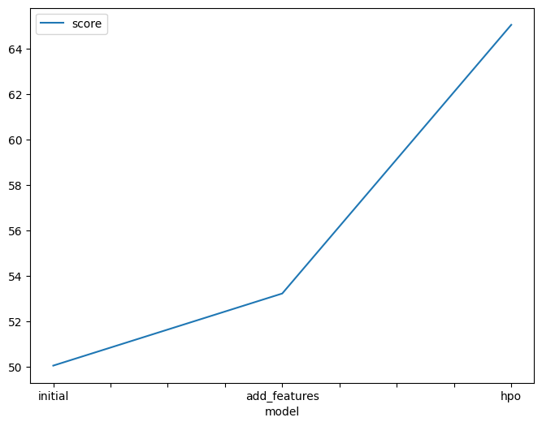
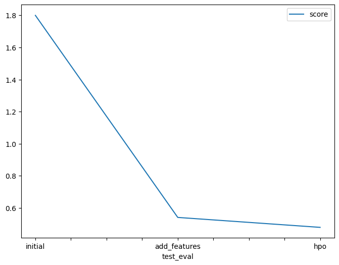

# Report: Predict Bike Sharing Demand with AutoGluon Solution
#### Naif Mersal

## Initial Training
### What did you realize when you tried to submit your predictions? What changes were needed to the output of the predictor to submit your results?
I realized that AutoGluon is a really powerful tool with few parameters you can get a very good base model. However, I know that making some changes in the input space could make the model much more powerful. 
### What was the top ranked model that performed?
WeightedEnsemble_L3 was the top-ranked model, and this is the case most of the time since it's the weighted average of many models.
## Exploratory data analysis and feature creation
### What did the exploratory analysis find and how did you add additional features?
First I converted the DateTime object to separate features as the suggestion. Then, plot a histogram for the features to see how the data is distributed.

the holiday and the weather features are unbalanced. The holiday, in fact, has almost no meaning to the model since just 3% of the data is a holiday. The weather also
has only one instance of class 4.

After seeing the correlation and all the plots, I decided to do the following:

1- take the average of atemp and temp \
2- remove class 4 and class 3 from the weather (this one after some experments i.e. drop the column, remove just 4 ... ) \
3- drop holiday, month(since season has almost the same meaning with less categories)

### How much better did your model perform after adding additional features and why do you think that is?
The model has improved dramatically. These are some reasons:

1- separating the DateTime object into (hour, day) excluding the others \
2- removing high correlated features which made the model less confused in general \
3- removing some of the outliers

## Hyper parameter tuning
### How much better did your model perform after trying different hyperparameters?
The model got better but not that much.
### If you were given more time with this dataset, where do you think you would spend more time?
I'll spend more time tuning the XGB model since it can improve (or get worse)with very few changes. Although neural networks have very good results, I ignore them because 
it takes time to train, so I'll take more time to tune their hyperparameters. Our data isn't complex that's another reason to ignore neural networks. However, with more time I'll make a test set to see when the models fail to get a reasonable prediction.
### Create a table with the models you ran, the hyperparameters modified, and the Kaggle score.
|model|XT|RF|XGB|score|
|--|--|--|--|--|
|initial|default|default|default|1.800|
|add_features|default|default|defualt|0.540|
|hpo|n_estimators, max_depth|n_estimators, max_depth|n_estimators, max_depth,learning_rate|0.478|

### Create a line plot showing the top model score for the three (or more) training runs during the project.

### Create a line plot showing the top Kaggle score for the three (or more) prediction submissions during the project.

## Summary
In summary, we have seen how autogluon(autoML in general) made the process of training ML easier, and how feature engineering can transform the model to the next level(Sometimes obligatory).
Also, We can see from the graph the importance of separating test and validation sets, and how the models were capturing the noise in data(low validation error vs high test error). Anyhow, the model could be better with more tuning and feature engineering. 